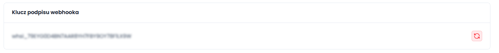

# Webhook
yshop.pl udostępnia funkcję webhooków, które pozwalają automatycznie wysyłać powiadomienia do Twojego serwisu po określonych zdarzeniach w sklepie — na przykład po zmianie statusu transakcji.
Poniżej znajdziesz instrukcję, jak poprawnie skonfigurować webhooki i zintegrować je z własnym systemem.

### Dodawanie endpointu
1. Przejdź do zakładki Integracje > Webhook w panelu yshop.pl
   

2. Przejdź do zakładki Adresy webhooków a następnie kliknij przycisk Dodaj adres
   

3. Wpisz adres URL twojego webhook'a i wybierz zdarzenia które mają być nasłuchiwane
   

4. Twój endpoint został zapisany

## Odbieranie powiadomień
Aby poprawnie obsłużyć webhook (powiadomienie) z yshop.pl, należy:
- Zweryfikować sygnaturę, aby potwierdzić, że powiadomienie pochodzi z yshop.pl.
- Po poprawnej weryfikacji zwrócić odpowiedź HTTP 200, informując system yshop.pl, że webhook został prawidłowo odebrany i przetworzony.
- Dane przesyłane od yshop.pl znajdują sie w body pod kluczem ``object``

```json
{
  "id": "uuid",
  "date": "data wysłania",
  "object": {} <- przesłane dane
}
```

### Sposób generowania sygnatury
Każdy webhook wysyłany przez system zawiera nagłówek:
```http
x-webhook-signature: <sygnatura>
```
Sygnatura służy do potwierdzenia poprawności żądania. Jest generowana na podstawie trzech elementów:
- id — id zdarzenia (pole w body)
- date — data wygenerowania webhooka (pole w body)
- klucz podpisu — klucz podpisu webhook'a znajduje się w panelu yshop.pl (Integracje > Webhook > Adresy webhooków)

  

Elementy te są łączone w jeden ciąg znaków za pomocą separatora | a następnie hashowane algorytmem SHA-256:
```js
id|date|klucz_podpisu
```
### Przykłady:
JavaScript/TypeScript (Express)
```js
app.post('/moj-webhook', (req, res) => {
    const signKey = "TWOJ KLUCZ DO GENEROWANIA SYGNATURY"
    
    const signature = req.headers['x-webhook-signature']
    const body = req.body

    const hash = crypto.createHash('sha256')
        .update(`${body.id}|${body.date}|${signKey}`)
        .digest('hex');
    
    if (hash != signature) {
        return res.status(401)
    }
    
    return res.status(200)
})
```