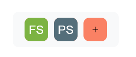

# Nowy sklep
Tworzenie nowego sklepu w serwisie yshop.pl jest szybkie i proste. Postępuj zgodnie z poniższymi krokami, aby skonfigurować swój sklep.

## Krok 1: Zalogowanie się do panelu

1. Wejdź na stronę [yshop.pl](https://yshop.pl).
2. Kliknij przycisk **Zaloguj się** w prawym górnym rogu strony.
3. Zostaniesz przekierowany na strone autoryzacyjną [id.ycode.pl](https://id.ycode.pl), gdzie wybierasz metodę autoryzacji

## Krok 2: Dodanie nowego sklepu

1. Po zalogowaniu się do panelu administracyjnego, kliknij przycisk **+** znajdujący się w menu na dole strony

## Krok 3: Wpisanie informacji o sklepie

W formularzu, który się pojawi, wprowadź następujące dane:

- **Nazwa sklepu** – podaj nazwę swojego sklepu (np. „Mój Sklep”).
- **Slug** – wybierz unikalny „slug” dla swojego sklepu, czyli końcówkę adresu URL (np. „moj-sklep” -> https://yshop.pl/shop/moj-slug).
- **Zdjęcie sklepu** – wklej link do logo twojego sklepu, więcej w zakładce Dodawanie zdjęć
- **Platforma** – wybierz platformę (gre) jaką będzie obsługiwał twój sklep

## Krok 4: Wybranie licencji

1. Wybierz odpowiednią licencję dla swojego sklepu:
    - **Free** – darmowa wersja z podstawowymi funkcjami.
    - **Premium** – wersja płatna z dodatkowymi funkcjami.

## Krok 5: Utworzenie sklepu

1. Po uzupełnieniu wszystkich wymaganych danych kliknij przycisk **Stwórz sklep**.
2. Twój sklep zostanie utworzony, a Ty zostaniesz przeniesiony do panelu zarządzania sklepem.

Gratulacje! Twój sklep jest gotowy do dalszej konfiguracji.