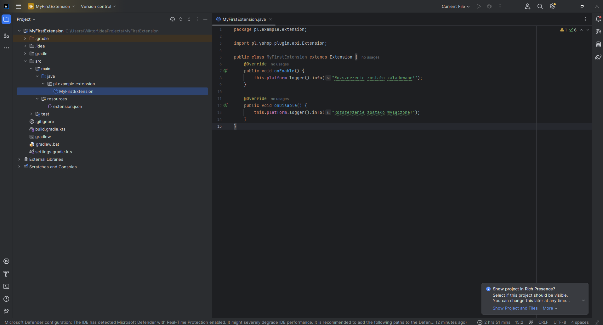

# API pluginu yshop
Nasz plugin posiada rozbudowane API, które pozwala na pisanie rozszerzeń.

### Tworzenie projektu
1. Tworzymy projekt gradle/maven w wybranych IDE, a następnie dodajemy zależność

```kotlin
repositories {
    maven("https://repository.ycode.pl/releases")
}

dependencies {
    implementation("pl.yshop.plugin:api:LATEST")
}
```
2. Tworzymy plik ``extension.json``
```json
{
  "main_class": "SCIEŻKA DO KLASY GŁÓWNEJ PROJEKTU",
  "version": "WERSJA np 1.0",
  "author": "AUTOR (opcjonalne)",
  "description": "OPIS PROJEKTU (opcjonalne)",
  "name": "NAZWA TWOJEGO ROZSZERZENIA",
  "supported_platforms": ["LISTA WSPIERANYCH PLATFORM"]
}
```
Wspierane platformy: **Bukkit, Bungee, Velocity**

3. Tworzymy klase główna projektu
```java
package pl.example.extension;

import pl.yshop.plugin.api.Extension;

public class MyFirstExtension extends Extension {
    @Override
    public void onEnable() {
    
    }

    @Override
    public void onDisable() {
    
    }
}
```
4. Finalna struktura projektu powinna być zbliżona do poniższego zdjęcia
